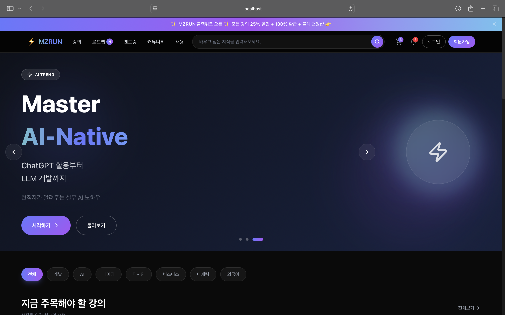

# MZRUN - LMS (Learning Management System)



온라인 강의 플랫폼 MZRUN의 풀스택 프로젝트입니다.

## 기술 스택

### Frontend
- **Framework**: React 19 + TypeScript
- **Build Tool**: Vite
- **Styling**: Tailwind CSS
- **Routing**: React Router DOM
- **Icons**: Lucide React

### Backend
- **Runtime**: Node.js + Express.js
- **Database**: SQLite (better-sqlite3)
- **Language**: TypeScript

### Monorepo
- **Package Manager**: pnpm Workspaces

## 시작하기

### 설치

```bash
pnpm install
```

### 개발 서버 실행

```bash
# 프론트엔드만 실행
pnpm dev

# 백엔드 API만 실행
pnpm dev:api

# 프론트 + 백엔드 동시 실행
pnpm dev:all
```

- 프론트엔드: `http://localhost:5173`
- 백엔드 API: `http://localhost:4000`

### 빌드

```bash
pnpm build
```

## 프로젝트 구조

```
figma_front/
├── apps/
│   ├── web/                     # 메인 웹 애플리케이션 (@lms/web)
│   │   ├── src/
│   │   │   ├── components/      # 재사용 가능한 컴포넌트
│   │   │   ├── pages/           # 페이지 컴포넌트
│   │   │   ├── data/            # Mock 데이터
│   │   │   ├── App.tsx
│   │   │   ├── main.tsx
│   │   │   └── index.css
│   │   └── package.json
│   │
│   └── api/                     # 백엔드 API 서버 (@lms/api)
│       ├── src/
│       │   ├── routes/          # API 라우터
│       │   │   ├── auth.ts      # 인증 (로그인/회원가입)
│       │   │   ├── courses.ts   # 강의 API
│       │   │   ├── categories.ts # 카테고리 API
│       │   │   └── user.ts      # 사용자 프로필 API
│       │   ├── db/
│       │   │   └── init.ts      # DB 초기화 및 시드 데이터
│       │   └── index.ts         # Express 서버 진입점
│       ├── data/
│       │   └── lms.db           # SQLite 데이터베이스
│       └── package.json
│
├── packages/
│   ├── ui/                      # 공유 UI 컴포넌트 (@lms/ui)
│   └── shared/                  # 공유 타입 및 유틸리티 (@lms/shared)
│
├── package.json                 # 루트 워크스페이스 설정
├── pnpm-workspace.yaml
└── tsconfig.json
```

## 워크스페이스 패키지

| 패키지 | 설명 |
|--------|------|
| `@lms/web` | 메인 웹 애플리케이션 (React) |
| `@lms/api` | 백엔드 API 서버 (Express) |
| `@lms/ui` | 공유 UI 컴포넌트 라이브러리 |
| `@lms/shared` | 공유 타입 및 유틸리티 |

## API 엔드포인트

### 인증 (Auth)
| Method | Endpoint | 설명 |
|--------|----------|------|
| POST | `/api/auth/signup` | 회원가입 |
| POST | `/api/auth/login` | 로그인 |

### 사용자 (User)
| Method | Endpoint | 설명 |
|--------|----------|------|
| GET | `/api/user/profile` | 프로필 조회 |
| PUT | `/api/user/profile` | 프로필 수정 |

### 강의 (Courses)
| Method | Endpoint | 설명 |
|--------|----------|------|
| GET | `/api/courses` | 강의 목록 (필터/정렬/페이지네이션) |
| GET | `/api/courses/:id` | 강의 상세 정보 |

### 카테고리 (Categories)
| Method | Endpoint | 설명 |
|--------|----------|------|
| GET | `/api/categories` | 카테고리 목록 |

### 쿼리 파라미터 (강의 목록)
- `category`: 카테고리 필터 (dev, ai, data, design, business, marketing, language)
- `search`: 제목/강사명 검색
- `tags`: 태그 필터 (NEW, 베스트, 할인중)
- `sort`: 정렬 (popular, latest, rating, price_low, price_high)
- `page`, `limit`: 페이지네이션

## 주요 기능

### 인증 시스템
- 회원가입 (이메일, 비밀번호, 마케팅 동의)
- 로그인/로그아웃
- 토큰 기반 인증
- 마이페이지

### 네비게이션
- 반응형 헤더 (모바일/데스크톱)
- 실시간 검색 기능 (강의명, 강사명 검색)
- 장바구니 및 알림 아이콘 (배지 표시)
- 로그인 상태에 따른 UI 변경 (로그인/로그아웃, 프로필)

### 메인 페이지
- 슬라이드 배너 (자동 전환, 애니메이션 효과)
- 인기 강의 목록
- 카테고리별 강의 필터링

### 강의
- **강의 목록 페이지**: 카테고리 필터, 검색, 정렬 기능
- **강의 상세 페이지**:
  - 강의 정보 (가격, 할인율, 평점, 수강생 수)
  - 강의 소개 프로모션 영상
  - 커리큘럼 (섹션별 접기/펼치기)
  - 강사 소개
  - 장바구니 담기 / 바로 구매 버튼

### 장바구니
- 강의 선택/해제 (전체 선택)
- 선택 항목 삭제
- 쿠폰 코드 입력
- 실시간 가격 계산 (할인 금액 표시)

### 마이페이지
- 프로필 정보 표시 (이름, 이메일, 가입일)
- 수강/완료 강의 통계
- 내 학습, 위시리스트, 주문 내역 메뉴
- 로그아웃

## 페이지 라우팅

| 경로 | 페이지 |
|------|--------|
| `/` | 메인 페이지 |
| `/login` | 로그인 |
| `/signup` | 회원가입 |
| `/mypage` | 마이페이지 |
| `/courses` | 강의 목록 |
| `/courses?search=검색어` | 강의 검색 결과 |
| `/courses?category=dev` | 카테고리별 강의 |
| `/course/:id` | 강의 상세 |
| `/roadmap` | 로드맵 |
| `/mentoring` | 멘토링 |
| `/community` | 커뮤니티 |
| `/jobs` | 채용 |
| `/cart` | 장바구니 |
| `/notifications` | 알림 |

## 데이터베이스 스키마

### users
| Column | Type | Description |
|--------|------|-------------|
| id | INTEGER | Primary Key |
| name | TEXT | 사용자 이름 |
| email | TEXT | 이메일 (Unique) |
| password | TEXT | 비밀번호 |
| agree_marketing | INTEGER | 마케팅 동의 여부 |
| created_at | TEXT | 가입일 |

### courses
| Column | Type | Description |
|--------|------|-------------|
| id | INTEGER | Primary Key |
| title | TEXT | 강의 제목 |
| instructor | TEXT | 강사명 |
| price | INTEGER | 가격 |
| original_price | INTEGER | 원가 |
| rating | REAL | 평점 |
| category | TEXT | 카테고리 |
| ... | ... | ... |

### categories
| Column | Type | Description |
|--------|------|-------------|
| id | TEXT | Primary Key |
| label | TEXT | 카테고리명 |

## 스타일 가이드

### 색상
- Primary Gradient: `#6778ff` → `#a855f7`
- Accent: `#6bc2f0`
- Background: `#0a0a0a`
- Glass Effect: `bg-white/5`, `border-white/10`

### 컴포넌트 스타일
- `btn-primary`: 그라디언트 버튼
- `btn-outline`: 테두리 버튼
- `glass`: 글래스모피즘 효과
- `gradient-text`: 그라디언트 텍스트
- `card-hover`: 카드 호버 효과

## 라이선스

© 2024 MEGAZONECLOUD Corp. All rights reserved.
