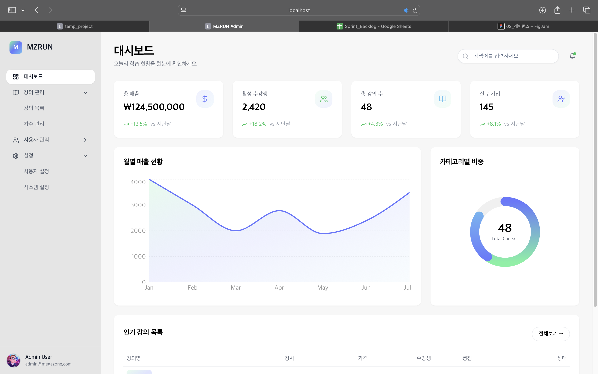

# MZRUN Admin Dashboard



Megazone 스타일의 LMS(Learning Management System) 관리자 대시보드입니다.

## 기술 스택

- **React** + **TypeScript**
- **Vite** (빌드 도구)
- **Tailwind CSS** (스타일링)
- **Radix UI** (컴포넌트 라이브러리)
- **Lucide React** (아이콘)

## 주요 기능

### 1. 대시보드
- 총 수익, 활성 수강생, 총 강의 수, 완료율 통계 카드
- 인기 강의 목록 테이블
- 실시간 현황 모니터링

### 2. 강의 관리
- 강의 목록 조회 및 검색
- 새 강의 등록 모달
- 강의 상태 관리 (Active, Best Seller, Draft)

### 3. 차수 관리
- 차수 목록 조회 및 검색
- 새 차수 등록 모달
- 차수 상태 관리 (진행중, 모집중, 종료)

### 4. 사용자 관리
- 사용자 목록 (준비 중)

### 5. 설정
- 사용자 설정 (테마, 알림)
- 시스템 설정 (준비 중)

## 다크/라이트 모드

### 테마 전환
- 사용자 설정 페이지에서 테마 토글 가능
- 전체 UI가 선택한 테마에 맞게 자동 변환

### 색상 팔레트

#### 다크 모드
| 용도 | 색상 코드 |
|------|----------|
| 사이드바 배경 | `#1a1a1a` |
| 메인 배경 | `#2a2a2a` |
| 카드 배경 | `#3a3a3a` |
| 버튼/hover 배경 | `#4a4a4a` ~ `#5a5a5a` |
| 네비 선택 배경 | `#4a4a4a` |
| 네비 hover 배경 | `#3a3a3a` |
| 비활성 Badge | `#7a7a7a` |

#### 라이트 모드
| 용도 | 색상 코드 |
|------|----------|
| 사이드바 배경 | `#e5e5e5` |
| 메인 배경 | `#f7f7f7` |
| 카드 배경 | `white` |
| 네비 선택 배경 | `white` + shadow |
| 네비 hover 배경 | `white/50` |

### 브랜드 컬러
| 용도 | 다크 모드 | 라이트 모드 |
|------|----------|------------|
| 활성/성공 (Active, 진행중) | `#70f2a0` | `#22c55e` |
| 강조/보라 (Best Seller, 모집중) | `#a0b0ff` | `#6778ff` |
| 정보/파랑 | `#6bc2f0` | `#6bc2f0` |

### Badge 스타일

```tsx
// Active / 진행중
isDarkMode ? 'bg-[#70f2a0]/15 text-[#70f2a0]' : 'bg-[#22c55e]/10 text-[#00a63e]'

// Best Seller / 모집중
isDarkMode ? 'bg-[#6778ff]/25 text-[#a0b0ff]' : 'bg-[#6778ff]/10 text-[#6778ff]'

// Draft / 종료
isDarkMode ? 'bg-[#7a7a7a] text-white' : 'bg-gray-100 text-gray-500'
```

### 버튼 스타일

```tsx
// 다크 모드 outline 버튼
'bg-[#4a4a4a] border-[#5a5a5a] text-gray-200 hover:bg-[#5a5a5a] hover:text-white'

// 다크 모드 primary 버튼
'bg-white hover:bg-gray-100 text-black'

// 라이트 모드 primary 버튼
'bg-black hover:bg-black/90 text-white'
```

### 사이드바 네비게이션

```tsx
// 선택된 메뉴
isDarkMode ? 'bg-[#4a4a4a] text-white' : 'bg-white text-gray-900 shadow-sm'

// 비선택 메뉴 hover
isDarkMode ? 'text-gray-400 hover:text-gray-200 hover:bg-[#3a3a3a]' : 'text-gray-600 hover:text-gray-900 hover:bg-white/50'

// 서브메뉴 선택
isDarkMode ? 'bg-white/10 text-white' : 'bg-white/70 text-gray-900'
```

## 프로젝트 구조

```
src/
├── components/
│   ├── admin/
│   │   └── AdminPage.tsx    # 메인 관리자 페이지
│   └── ui/
│       ├── button.tsx       # 버튼 컴포넌트
│       ├── card.tsx         # 카드 컴포넌트
│       ├── dialog.tsx       # 다이얼로그/모달
│       ├── input.tsx        # 입력 필드
│       ├── label.tsx        # 라벨
│       ├── select.tsx       # 셀렉트 드롭다운
│       ├── table.tsx        # 테이블
│       ├── textarea.tsx     # 텍스트 영역
│       ├── avatar.tsx       # 아바타
│       ├── badge.tsx        # 뱃지
│       ├── dropdown-menu.tsx # 드롭다운 메뉴
│       └── utils.ts         # 유틸리티 함수 (cn)
├── styles/
│   └── globals.css          # 전역 스타일
└── main.tsx                 # 앱 엔트리포인트
```

## 설치 및 실행

```bash
# 의존성 설치
npm install

# 개발 서버 실행
npm run dev

# 빌드
npm run build
```

## UI 컴포넌트

모든 UI 컴포넌트는 Radix UI 기반으로 구축되어 있으며, 접근성(a11y)을 지원합니다.

- 모든 컴포넌트는 `rounded-xl` 또는 `rounded-full` 스타일 적용
- 포커스 시 `ring-2 ring-black` 스타일로 접근성 강화
- 다크/라이트 모드에 따른 조건부 스타일링

## 디자인 가이드라인

1. **둥근 모서리**: 모든 요소에 부드러운 둥근 모서리 적용
2. **그라데이션**: 브랜드 로고에 `from-[#70f2a0] via-[#6778ff] to-[#6bc2f0]` 그라데이션 사용
3. **색상 대비**: 다크 모드에서 충분한 명도 차이로 가독성 확보
4. **일관된 간격**: Tailwind의 spacing 시스템 활용
5. **애니메이션**: `transition-all duration-300`으로 부드러운 전환 효과
